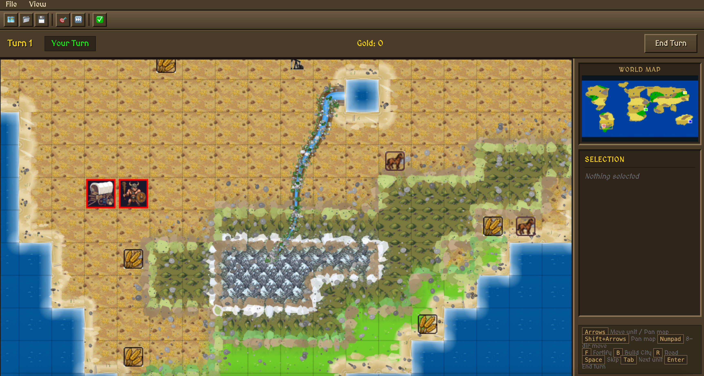

# YaC (Yet Another Civilization)



A web-based, single-player strategy game inspired by Civilization 1 (1991), built with Go backend and HTML5 Canvas frontend.

## Features

- **Procedural Map Generation**: Random or Earth-like maps with continents, oceans, mountains, hills, forests, and deserts
- **Rivers & Lakes**: Natural river systems flowing from highlands to ocean with deltas, plus inland lakes
- **Resources**: Various resources (gold, iron, coal, horses, wheat, etc.) scattered across the map
- **Units**: Settlers, Warriors, Phalanx, Archers, Horsemen, Catapults
- **Cities**: Found cities, manage production, build units and buildings
- **Combat**: Turn-based combat with terrain bonuses and fortification
- **Roads**: Build roads with settlers to connect your empire
- **AI Opponents**: Computer-controlled players with basic strategy
- **Save/Load**: Save and load game progress

## Tech Stack

- **Backend**: Go with WebSocket for real-time updates
- **Frontend**: HTML5 Canvas with vanilla JavaScript
- **Architecture**: Server-authoritative game state

## Prerequisites

- Go 1.21 or later
- Modern web browser (Chrome, Firefox, Safari, Edge)

## Building & Running

```bash
# Clone the repository
git clone <repository-url>
cd civilization

# Build the server
make

# Run the server
make run
```

The server starts at [http://localhost:8888](http://localhost:8888)

## Project Structure

```
civilization/
├── cmd/server/main.go           # Entry point
├── internal/
│   ├── game/                    # Core game logic
│   │   ├── game.go              # GameState, turn processing
│   │   ├── player.go            # Player struct
│   │   ├── map.go               # Map, Tile, terrain types
│   │   ├── unit.go              # Units, movement
│   │   ├── city.go              # Cities, production
│   │   ├── combat.go            # Combat resolution
│   │   ├── actions.go           # Player actions
│   │   └── constants.go         # Balance constants
│   ├── mapgen/                  # Map generation
│   │   ├── generator.go         # Main generator
│   │   └── noise.go             # Perlin noise
│   ├── ai/                      # AI opponents
│   │   ├── ai.go                # AI controller
│   │   ├── strategy.go          # Decision making
│   │   └── pathfinding.go       # A* pathfinding
│   └── api/                     # HTTP/WebSocket layer
│       ├── server.go            # HTTP server
│       ├── websocket.go         # WebSocket hub
│       └── messages.go          # Message types
├── web/                         # Frontend
│   ├── index.html
│   ├── css/style.css
│   └── js/
│       ├── main.js              # Bootstrap
│       ├── game.js              # Client state
│       ├── renderer.js          # Canvas rendering
│       ├── input.js             # Mouse/keyboard
│       ├── ui.js                # UI management
│       ├── websocket.js         # WS client
│       ├── sprites.js           # Sprite management
│       └── config.js            # Configuration
├── assets/                      # Game assets
│   ├── tiles/                   # Terrain sprites
│   ├── units/                   # Unit sprites
│   └── resources/               # Resource sprites
├── go.mod
└── README.md
```

## Controls

### Mouse
- **Left Click**: Select units/cities, interact with UI
- **Right Click + Drag**: Pan the map
- **Scroll Wheel / Touchpad**: Pan the map
- **Minimap Click**: Jump to location

### Keyboard
| Key | Action |
|-----|--------|
| Arrow Keys | Move selected unit / Pan map |
| Shift + Arrows | Pan map |
| Numpad 1-9 | 8-directional unit movement |
| M | Enter move mode |
| A | Enter attack mode |
| F | Fortify unit |
| B | Build city (settlers only) |
| R | Build road (settlers only) |
| Space / S | Skip unit |
| Tab | Select next unit |
| Enter | End turn |
| C | Center on selected unit |

## Game Mechanics

### Terrain Types
| Terrain | Movement Cost | Defense Bonus | Food | Production |
|---------|---------------|---------------|------|------------|
| Ocean | - (impassable) | - | 1 | 0 |
| Grassland | 1 | 1.0x | 2 | 0 |
| Plains | 1 | 1.0x | 1 | 1 |
| Desert | 1 | 1.0x | 0 | 0 |
| Hills | 2 | 1.5x | 1 | 2 |
| Mountains | 3 | 2.0x | 0 | 1 |
| Forest | 2 | 1.5x | 1 | 2 |

### Units
| Type | Attack | Defense | Movement | Cost | Special |
|------|--------|---------|----------|------|---------|
| Settler | 0 | 1 | 1 | 40 | Can found cities, build roads |
| Warrior | 1 | 1 | 1 | 10 | - |
| Phalanx | 1 | 2 | 1 | 20 | - |
| Archer | 2 | 1 | 1 | 20 | - |
| Horseman | 2 | 1 | 2 | 20 | - |
| Catapult | 6 | 1 | 1 | 40 | - |

### Buildings
| Building | Cost | Effect |
|----------|------|--------|
| Barracks | 40 | Units built are veterans |
| Granary | 60 | Keep 50% food on growth |
| Walls | 80 | 2x defense in city |

## Configuration

The server listens on port 8080 by default. Configuration can be modified in:
- `cmd/server/main.go` - Server settings
- `web/js/config.js` - Client settings

## License

This project is licensed under the Apache License 2.0 - see the [LICENSE](LICENSE) file for details.

## Acknowledgments

- Inspired by Sid Meier's Civilization (1991)
- Built with Go and vanilla JavaScript
